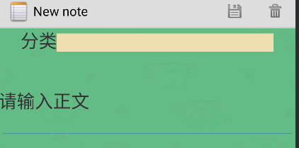
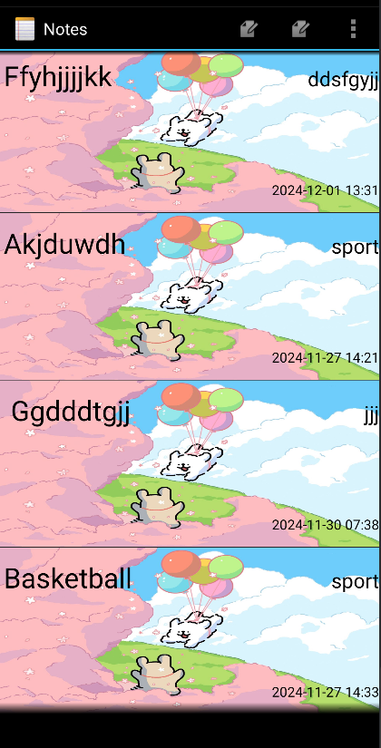
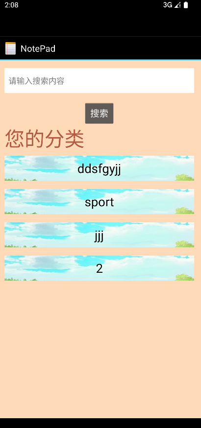

# 安卓开发记事本期中作业
陈俊 121052022123
## 一：时间戳的实现
### 展示

### 实现步骤

1. 要多投影出一列
   
   ``` java
       private static final String[] PROJECTION = new String[] {
            NotePad.Notes._ID, // 0
            NotePad.Notes.COLUMN_NAME_TITLE, // 1
            NotePad.Notes.COLUMN_NAME_CREATE_DATE,// 2
            NotePad.Notes.COLUMN_NAME_TYPE
    };
   ```
2. 为其绑定显示的视图
   ``` java
           String[] dataColumns = { NotePad.Notes.COLUMN_NAME_TITLE,NotePad.Notes.COLUMN_NAME_CREATE_DATE,NotePad.Notes.COLUMN_NAME_TYPE} ;
        int[] viewIDs = { android.R.id.text1, R.id.text_time,R.id.texttype};
        SimpleCursorAdapter adapter
            = new SimpleCursorAdapter(
                      this,                             // The Context for the ListView
                      R.layout.noteslist_item,          // Points to the XML for a list item
                      cursor,                           // The cursor to get items from
                      dataColumns,
                      viewIDs
              );
    ```
3. 将时间戳格式化
   ``` java
    adapter.setViewBinder(new SimpleCursorAdapter.ViewBinder() {
            @Override
            public boolean setViewValue(View view, Cursor cursor, int columnIndex) {
                if (columnIndex == cursor.getColumnIndex(NotePad.Notes.COLUMN_NAME_CREATE_DATE)) {
                    long createDateTimestamp = cursor.getLong(columnIndex);
                    Date date = new Date(createDateTimestamp);
                    SimpleDateFormat sdf = new SimpleDateFormat("yyyy-MM-dd HH:mm");
                    String formattedDate = sdf.format(date);
                    ((TextView) view).setText(formattedDate);
                    return true;
                }
                return false;
            }
        });
   ```
## 二：搜索功能
### 展示
   
### 实现步骤
1. 新建search.xml文件，search.jave文件创建好布局
2. 为搜索按钮添加点击事件
   ``` java
    Button button = (Button) findViewById(R.id.button_search);
        ListView listView1= (ListView) findViewById(android.R.id.list);
        listView1.setOnItemClickListener(new AdapterView.OnItemClickListener() {
            @Override
            public void onItemClick(AdapterView<?> parent, View view, int position, long id) {
                // 通过position获取被点击项对应的视图（这里假设每一项布局中有一个id为typeitem的TextView用于展示文本）
                TextView textView = (TextView) view.findViewById(R.id.typeitem);
                if (textView!= null) {
                    String text = textView.getText().toString();
                    // 这里就获取到了被点击项中TextView的文字内容，可以进行后续操作，比如打印或者传递给其他方法等
                    Intent intent = new Intent(search.this,NotesList.class);
                    Bundle bundle = new Bundle();
                    bundle.putString("message",text);
                    intent.putExtras(bundle);
                    startActivity(intent);
                }
            }
        });
        button.setOnClickListener(new View.OnClickListener() {
            @Override
            public void onClick(View view) {
                EditText editText = (EditText) findViewById(R.id.editText_search);
                final String message = String.valueOf(editText.getText());

                Intent intent = new Intent(search.this,NotesList.class);
                Bundle bundle = new Bundle();
                bundle.putString("message",message);
                intent.putExtras(bundle);
                startActivity(intent);
            }
        });

   ```
   点击时可以将edittext的文字作为参数跳转到noelist界面
3. 在notelist界面接收参数并筛选相应的数据
   ``` java
     String message = intent.getStringExtra("message");
        if (message == null) {
            message = ""; // 如果没有传递message，设置为空字符串避免后续SQL语句语法问题
        }
        String selection = NotePad.Notes.COLUMN_NAME_TITLE + " LIKE '%" + message + "%' OR " +
                NotePad.Notes.COLUMN_NAME_NOTE + " LIKE '%" + message + "%' OR "+NotePad.Notes.COLUMN_NAME_TYPE+ " LIKE '%" +message + "%'";
        String[] selectionArgs = {};

   ```
## 分类功能
### 展示


### 实现步骤
1. 数据库多加一个属性
   ``` java
       private static final String[] READ_NOTE_PROJECTION = new String[] {
            NotePad.Notes._ID,               // Projection position 0, the note's id
            NotePad.Notes.COLUMN_NAME_NOTE,  // Projection position 1, the note's content
            NotePad.Notes.COLUMN_NAME_TITLE, // Projection position 2, the note's title
            NotePad.Notes.COLUMN_NAME_TYPE
    };
    ```
    ``` java
        static {
        sUriMatcher = new UriMatcher(UriMatcher.NO_MATCH);
        sUriMatcher.addURI(NotePad.AUTHORITY, "notes", NOTES);
        sUriMatcher.addURI(NotePad.AUTHORITY, "notes/#", NOTE_ID);
        sUriMatcher.addURI(NotePad.AUTHORITY, "live_folders/notes", LIVE_FOLDER_NOTES);
        sNotesProjectionMap = new HashMap<String, String>();
        sNotesProjectionMap.put(NotePad.Notes._ID, NotePad.Notes._ID);
        sNotesProjectionMap.put(NotePad.Notes.COLUMN_NAME_TITLE, NotePad.Notes.COLUMN_NAME_TITLE);
        sNotesProjectionMap.put(NotePad.Notes.COLUMN_NAME_NOTE, NotePad.Notes.COLUMN_NAME_NOTE);
        sNotesProjectionMap.put(NotePad.Notes.COLUMN_NAME_TYPE, NotePad.Notes.COLUMN_NAME_TYPE);
        sNotesProjectionMap.put(NotePad.Notes.COLUMN_NAME_CREATE_DATE,
                NotePad.Notes.COLUMN_NAME_CREATE_DATE);
        sNotesProjectionMap.put(
                NotePad.Notes.COLUMN_NAME_MODIFICATION_DATE,
                NotePad.Notes.COLUMN_NAME_MODIFICATION_DATE);
        sLiveFolderProjectionMap = new HashMap<String, String>();
        sLiveFolderProjectionMap.put(LiveFolders._ID, NotePad.Notes._ID + " AS " + LiveFolders._ID);
        sLiveFolderProjectionMap.put(LiveFolders.NAME, NotePad.Notes.COLUMN_NAME_TITLE + " AS " +
            LiveFolders.NAME);
    }
    ```
    ``` java
               db.execSQL("CREATE TABLE " + NotePad.Notes.TABLE_NAME + " ("
                   + NotePad.Notes._ID + " INTEGER PRIMARY KEY,"
                   + NotePad.Notes.COLUMN_NAME_TITLE + " TEXT,"
                   + NotePad.Notes.COLUMN_NAME_NOTE + " TEXT,"
                   + NotePad.Notes.COLUMN_NAME_CREATE_DATE + " INTEGER,"
                   + NotePad.Notes.COLUMN_NAME_TYPE + " TEXT, "
                   + NotePad.Notes.COLUMN_NAME_MODIFICATION_DATE + " INTEGER"
                   + ");");
    ```
    将数据库版本加一，这样数据库改动才会生效
    ```
       private static final int DATABASE_VERSION = 3;
    ```
2. notelist界面多投影一列并绑定到相应的视图，同时间戳
3. 在search界面展示所有的分类
   ``` java
     ListView listView = (ListView) findViewById(android.R.id.list);
        String selection = NotePad.Notes.COLUMN_NAME_TYPE + ">1)" + "GROUP BY (" + NotePad.Notes.COLUMN_NAME_TYPE;

        String[] selectionArgs = {};

        Cursor cursor = managedQuery(
                NotePad.Notes.CONTENT_URI,
                PROJECTION,
                selection,
                selectionArgs,
                NotePad.Notes.DEFAULT_SORT_ORDER
        );
        // 定义要显示的字段数组，这里只显示NotePad.Notes.COLUMN_NAME_TYPE字段，你可根据需求添加其他字段
        String[] dataColumns = {NotePad.Notes.COLUMN_NAME_TYPE};
        // 对应的布局文件（用于定义ListView的列表项样式）中控件id数组，这里假设布局中显示该字段的TextView的id是R.id.typeitem（如果使用前面创建的新布局文件，就是对应新布局里的id）
        int[] viewIDs = {R.id.typeitem};

        // 创建SimpleCursorAdapter，将查询到的Cursor数据与ListView的列表项布局进行绑定
        SimpleCursorAdapter adapter = new SimpleCursorAdapter(
                this,
                R.layout.list_item_type,  // 如果创建了新布局文件，就替换为新布局的资源ID；如果没创建就使用原布局里的默认样式（不过原布局需确保有对应id的控件）
                cursor,
                dataColumns,
                viewIDs
        );

        // 将适配器设置给ListView，这样ListView就能显示查询到的数据了
        listView.setAdapter(adapter);

   ```
   其中查询语句限制了非空和去重
3. 设置点击跳转查询
   ``` java
    ListView listView1= (ListView) findViewById(android.R.id.list);
        listView1.setOnItemClickListener(new AdapterView.OnItemClickListener() {
            @Override
            public void onItemClick(AdapterView<?> parent, View view, int position, long id) {
                // 通过position获取被点击项对应的视图（这里假设每一项布局中有一个id为typeitem的TextView用于展示文本）
                TextView textView = (TextView) view.findViewById(R.id.typeitem);
                if (textView!= null) {
                    String text = textView.getText().toString();
                    // 这里就获取到了被点击项中TextView的文字内容，可以进行后续操作，比如打印或者传递给其他方法等
                    Intent intent = new Intent(search.this,NotesList.class);
                    Bundle bundle = new Bundle();
                    bundle.putString("message",text);
                    intent.putExtras(bundle);
                    startActivity(intent);
                }
            }
        });

   ```
   这样可以实现点击哪个分类就查询哪个分类的笔记
4. 在编辑笔记的时候加入分类编辑
   
   xml文件里加一个linnerlayout就可以了
   但是要修改noteedit文件的update方法
    ```
        EditText editText = (EditText) findViewById(R.id.typetext);
        String type = editText.getText().toString();
        values.put(NotePad.Notes.COLUMN_NAME_TYPE,type);
    ```
    将分类的值加到要加到数据库的数据中
5. 投影时多投影一列，将分类投影出来
   ``` java
           new String[] {
            NotePad.Notes._ID,
            NotePad.Notes.COLUMN_NAME_TITLE,
            NotePad.Notes.COLUMN_NAME_NOTE,
            NotePad.Notes.COLUMN_NAME_TYPE
        };
   ```
   然后将投影出的数据绑定到相应的edittext就可以啦
## ui美化
### 展示



